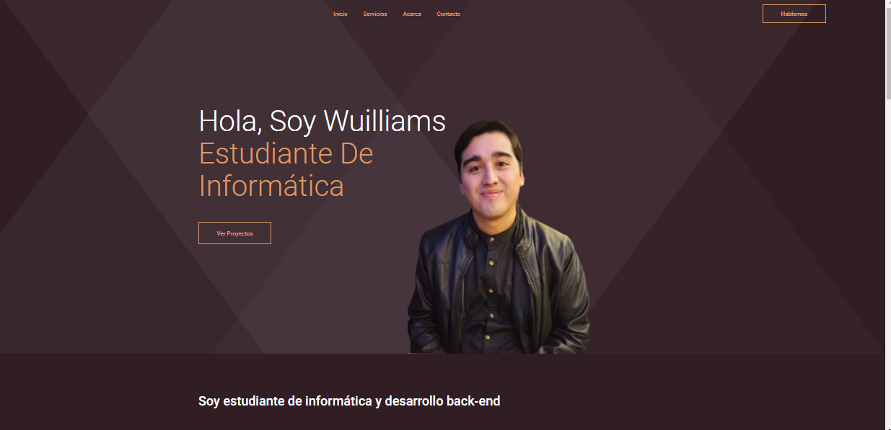
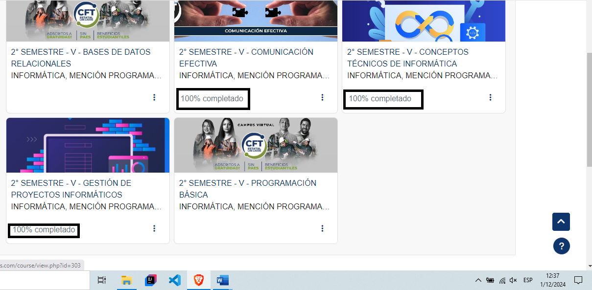
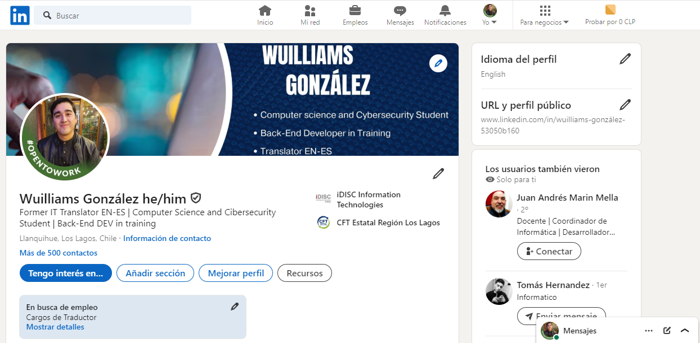
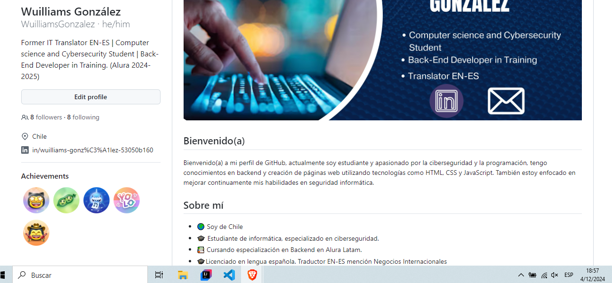
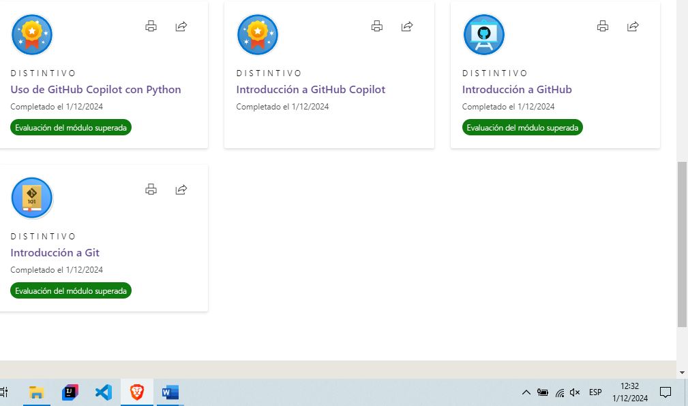

# Examen Final - Conceptos Técnicos

## Nombre del Alumno: Wuilliams González 
## CFT Los Lagos

Este repositorio contiene la evidencia organizada para el examen final de **Conceptos Técnicos**, con el fin de mostrar los logros y actividades realizadas durante el curso. A continuación se detallan los componentes del repositorio.

---

## Descripción del Examen

El examen final consistió en demostrar la adquisición de conocimientos en diversas áreas técnicas cubiertas en el curso, incluyendo el uso de herramientas como GitHub, LinkedIn, Microsoft Learn y el desarrollo de un portafolio personal.

---

## Detalles de la Evidencia

A continuación, se describen los diferentes elementos que forman parte de la evidencia presentada:

1. **Capturas de Pantalla:**
   - Cuestionarios realizados a lo largo del curso.
   - Perfil de LinkedIn actualizado, mostrando logros y actividades profesionales.
   - Medallas obtenidas en GitHub por contribuciones y logros técnicos.
   - Módulos completados en Microsoft Learn, mostrando el progreso y la finalización de los módulos.
   - Evaluaciones de Quinttos sus capturas están en la carpeta del mismo, con las notas de evidencia.
   
2. **Portafolio:**
   - El portafolio personal se encuentra alojado en este repositorio. Está compuesto por una página web que resume proyectos, habilidades y logros obtenidos durante el curso. Puede ser consultado en la carpeta `/portafolio`.

---

## Capturas de Pantalla

### Portafolio 

### Cuestionarios:

### Perfil de LinkedIn:

### Medallas de GitHub:

### Microsoft Learn:

---

## Instrucciones para Ver el Portafolio

1. Navegar hasta la carpeta `/portafolio`.
2. Ir a configuraciones - Github pages - abrir link.

---
Creado por Wuilliams González | Diciembre-2024
